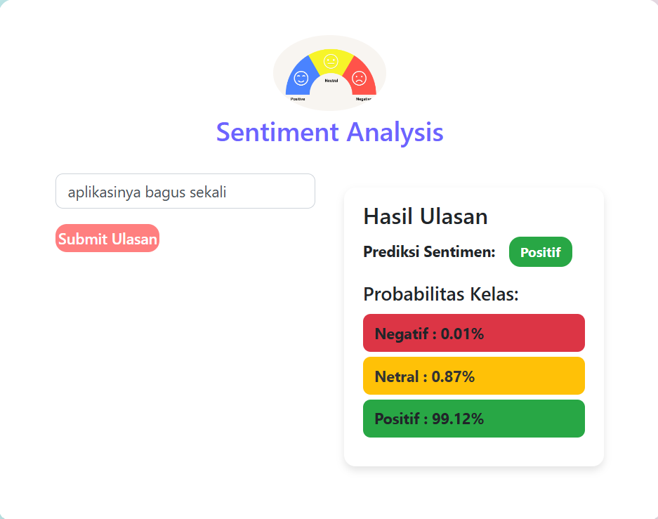
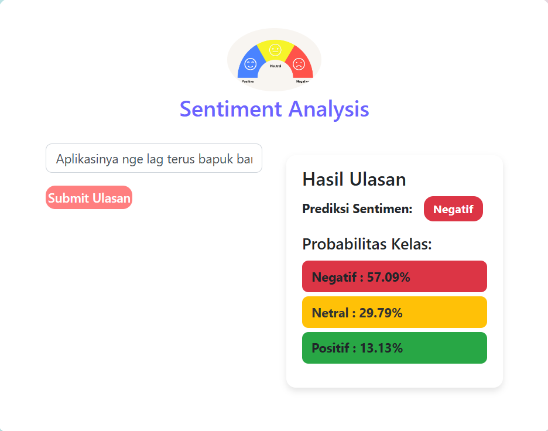
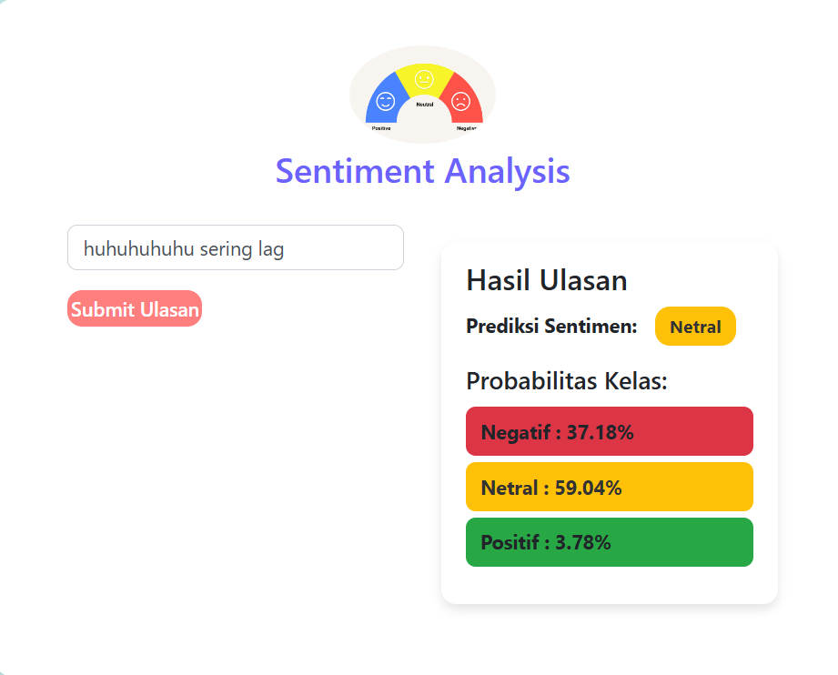

## Berikut adalah langkah-langkah untuk menjalankan Dashboard.
### Step
1. Download Semua Folder (Project)
2. Buka Folder Poject di VS Code
3. buat dan aktifkan Environtment dengan cara:
        <pre>python -m venv venv </pre>
        <pre>venv\Scripts\activate </pre>
4.Buka direktori proyek contoh
    <pre>cd Dashboard </pre>
5. Setelah aktif env dan membuka direktori yang dituju, aktifkan flask dengan cara:
    <pre>set FLASK_APP=app.py</pre>
5. Lalu Jalankan Flask dengan cara:
    <pre>python app.py</pre>
    atau
    <pre>flask Run</pre>
note:
 Pastikan OUT DIR pada app.py Sesuai dengan tempat menyimpan file misalnya 
  <pre>D:\Data Salsa\Kuliah\Data Analyst\Project_Sentiment Analyst\Dashboard\repo_output</pre>

### Contoh
Berikut adalah beberapa contoh tampilan dashboard
1. berikut adalah hasil dimana Dashboad dapat mendeteksi Kalimat atau Ulasan dan Hal Positif

2. berikut adalah hasil dimana Dashboad dapat mendeteksi Kalimat atau Ulasan dan Hal Negatif

3. berikut adalah hasil dimana Dashboad dapat mendeteksi Kalimat atau Ulasan dan Hal Netral
